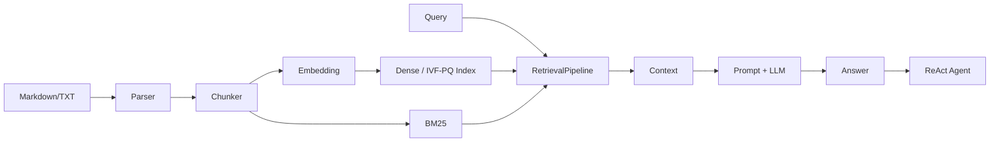

# 01｜RAG 全链路

> 状态：**已实现** ｜ 路径：快速离线 + 可选真实模型

## 学习目标与先修知识

- 说清 RAG 解决的不是“让模型永久学会文档”，而是在生成时提供外部证据。
- 能从 `index`、`ask`、`chat` 三个入口追踪数据流。
- 识别项目的六层架构和每层的稳定接口。

## 当前实现边界

项目已完成文档处理、嵌入封装、NumPy/IVF-PQ 索引、混合检索、Prompt、生成封装和 Mock Agent。真实 GGUF、真实 Cross-Encoder、真实 KV 前缀复用还没有完成质量验证。这里讲的是工程型“retrieve then generate”，不是原始 RAG 论文中的端到端联合训练。

## 概念直觉与核心公式

LLM 参数是**参数记忆**，向量索引中的文档是**非参数记忆**。给定问题 `x` 和候选文档 `z`，RAG 的直觉可写成：

```text
p(y | x) ≈ Σ_z p(z | x) · p(y | x, z)
```

本项目把它拆成可替换组件：检索器近似 `p(z|x)`，生成器近似 `p(y|x,z)`。这种拆分便于学习和测试，但不意味着两个部分被联合优化。



## 项目调用链

- `index`：`src.cli.main.index` → parser → chunker → embedding → vector store → `save()`。
- `ask`：`load()` → `RetrievalPipeline.retrieve()` → `RAGPromptBuilder.build()` → `generate_stream()`。
- `chat`：加载同一检索管道 → 注册搜索工具 → `ReActAgent.run()` → 工具调用与多轮记忆。

稳定接口是 `BaseEmbedding`、`BaseVectorStore`、`BaseReranker` 和 `BaseLLM`。替换底层实现时，上层只依赖接口，不需要知道 NumPy、C++ 或 llama.cpp 的细节。

## 最小实验

```powershell
python examples/learning/run_lab.py --lab 01
```

实验使用确定性 `ToyEmbedding`、真实 `NumpyVectorStore/Retriever/RAGPromptBuilder` 和 `MockLLM`。预期看到文档块被召回、进入 Prompt，然后得到明确标记的 Mock 回答。它验证连接关系，不验证语言模型质量。

## 常见错误、边界与反例

- 检索到正确文档不保证生成一定忠实，生成仍需评估。
- Mock 回答固定，不代表 Prompt 或模型真的理解了内容。
- RAG 可以更新外部知识，但索引未重建时仍会读取旧内容。
- 召回失败时继续调生成温度通常无效，应先检查分块、嵌入和检索。

## 练习

1. 为什么把文档写进 Prompt 不等于微调模型？
2. 若 `ask` 没有检索结果，最先应检查哪三层？

<details><summary>参考答案</summary>

1. Prompt 只影响本次推理上下文，不修改模型权重。2. 先检查文档是否解析/分块成功、嵌入维度和模型是否一致、索引是否加载且查询路径使用了正确后端。

</details>

## 完成检查

- [ ] 能画出 index 与 ask 的不同数据流。
- [ ] 能指出参数记忆和非参数记忆分别在哪里。
- [ ] 不把 Mock 通过描述为真实生成质量通过。

## 原始资料

- Lewis et al., [Retrieval-Augmented Generation](https://papers.nips.cc/paper/2020/hash/6b493230205f780e1bc26945df7481e5-Abstract.html).

上一章：[00｜课程指南](00_course_guide.md) ｜ 下一章：[02｜文档处理](02_document_processing.md)
