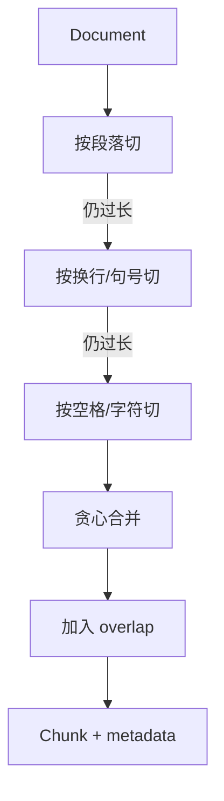

# 02｜文档处理

> 状态：**已实现** ｜ 路径：快速离线

## 学习目标与先修知识

- 理解为什么检索单位通常是 Chunk 而不是整篇文档。
- 掌握解析器工厂、递归字符分块、固定窗口和 overlap。
- 能用边界样例检查分块是否丢信息、重复过多或破坏语义。

## 当前实现边界

`MarkdownParser` 和 `TextParser` 读取 UTF-8 文件；PDF 尚未实现。`RecursiveChunker` 以**字符数**而不是 tokenizer token 数控制大小，因此 `chunk_size=512` 不等于 512 tokens。

## 概念直觉与核心公式

分块是在两个目标间取舍：块太大，检索不够精确且占用上下文；块太小，语义容易被切断。固定窗口的步长为：

```text
step = chunk_size - chunk_overlap
```

长度为 `L` 的文本大约产生：

```text
N ≈ ceil(max(0, L - overlap) / step)
```

递归分块先尝试段落、换行、句号、空格，最后才逐字符切分；它不是语义模型，只是尽量保留自然边界。



## 项目调用链

- 数据模型：`src/document/__init__.py` 中的 `Document` 与 `Chunk`。
- 文件选择：`get_parser()` 遍历注册表，按扩展名选择 parser。
- 递归策略：`RecursiveChunker._split_text()` 与 `_merge_splits()`。
- 基线策略：`FixedWindowChunker.chunk()`。
- 验证：`tests/test_phase1.py` 的 parser、chunker 和 overlap 测试。

## 最小实验

```powershell
python examples/learning/run_lab.py --lab 02
```

预期现象：固定窗口严格按位置滑动；递归策略更倾向保留段落和句子边界。增大 overlap 会增加块间重复，也会增加索引规模。

## 常见错误、边界与反例

- `chunk_overlap >= chunk_size` 会使固定窗口无法前进并抛错。
- 递归分块加入上一块尾部后，个别块可能略超目标大小；`chunk_size` 是工程目标，不是 token 硬上限。
- overlap 只能缓解边界断裂，不能修复错误编码或空文档。
- metadata 必须从 Document 继承，否则无法在回答中展示来源。

## 练习

1. 为什么法律条款和源代码不应直接复用同一套 separators？
2. overlap 从 0 增到 50% 会带来什么收益和代价？

<details><summary>参考答案</summary>

1. 两类文本的自然边界不同：法律文本以条款为单位，源代码以函数、类和语法块为单位。2. 更不容易丢失跨边界语义，但重复向量、索引内存、构建时间和候选冗余都会增加。

</details>

## 完成检查

- [ ] 能解释 Document 与 Chunk 的一对多关系。
- [ ] 能用一个反例测试边界语义是否被切断。
- [ ] 知道当前大小单位是字符而不是 token。

上一章：[01｜RAG 全链路](01_rag_architecture.md) ｜ 下一章：[03｜嵌入模型](03_embeddings.md)
