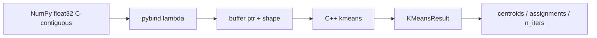

# 05｜C++、pybind11 与 K-Means

> 状态：**已实现** ｜ 路径：需要已构建的 `agentrag_core`

## 学习目标与先修知识

- 理解 Python 负责组装、C++ 负责热路径的分工。
- 看懂二维 NumPy float32 数组如何传给 C++ 指针。
- 掌握 K-Means 的目标函数、分配/更新循环和可复现种子。

## 当前实现边界

C++17 扩展通过 pybind11 暴露 K-Means、IVF、PQ、IVF-PQ 和 BM25。构建脚本能发现标准工具链，并允许用环境变量指定非标准 Python/CMake/MSVC。当前算法面向教学，没有 SIMD、OpenMP 或 GPU 优化。

## 概念直觉与核心公式

K-Means 把样本分给最近中心，最小化簇内平方距离：

```text
J = Σ_i ||x_i - μ_{c_i}||²
```

每轮交替执行：

1. Assignment：`c_i = argmin_j ||x_i-μ_j||²`。
2. Update：`μ_j = mean({x_i | c_i=j})`。

单轮主要复杂度约 `O(NKd)`。固定种子只能保证当前实现的初始化可重复，不代表得到全局最优。

## 项目调用链



- 构建入口：根 `CMakeLists.txt`、`src/core/CMakeLists.txt`、`scripts/build_cpp.bat`。
- 绑定入口：`src/core/pybind/module.cpp`。
- 算法：`src/core/src/kmeans.cpp`。
- pybind 层只检查维度；dtype/连续性约束应在 Python 调用前明确处理。

## 最小实验

```powershell
scripts\build_cpp.bat
python examples/learning/run_lab.py --lab 05
```

预期现象：两组相距较远的二维点被分到两个簇；中心顺序可能交换，因此验收应看簇分离而不是固定 label。

## 常见错误、边界与反例

- 聚类 label 没有语义，`0/1` 对调不算失败。
- 当前初始化是按固定 RNG 随机取样，可能重复选中心；困难数据应多种子验证。
- `k>N` 时底层返回空/零结果，不应作为有效训练。
- 扩展编译成功不等于算法正确，仍需 Python 集成测试和数值反例。

## 练习

1. 为什么 K-Means 使用平方 L2 时不需要在比较阶段开平方？
2. pybind 直接传指针的主要收益和风险是什么？

<details><summary>参考答案</summary>

1. 平方根是单调函数，不改变距离排序，省掉开平方。2. 收益是减少数据复制和 Python 循环；风险是 dtype、连续性、维度和生命周期不匹配会产生错误，绑定层必须验证输入。

</details>

## 完成检查

- [ ] 能解释一次 K-Means 迭代。
- [ ] 能指出 Python/C++ 边界上的 shape 和 dtype 约束。
- [ ] 不把 label 数字当作固定类别名。

## 原始资料

- [pybind11 官方文档](https://pybind11.readthedocs.io/).

上一章：[04｜精确向量检索](04_exact_vector_search.md) ｜ 下一章：[06｜残差 IVF-PQ](06_residual_ivfpq.md)
