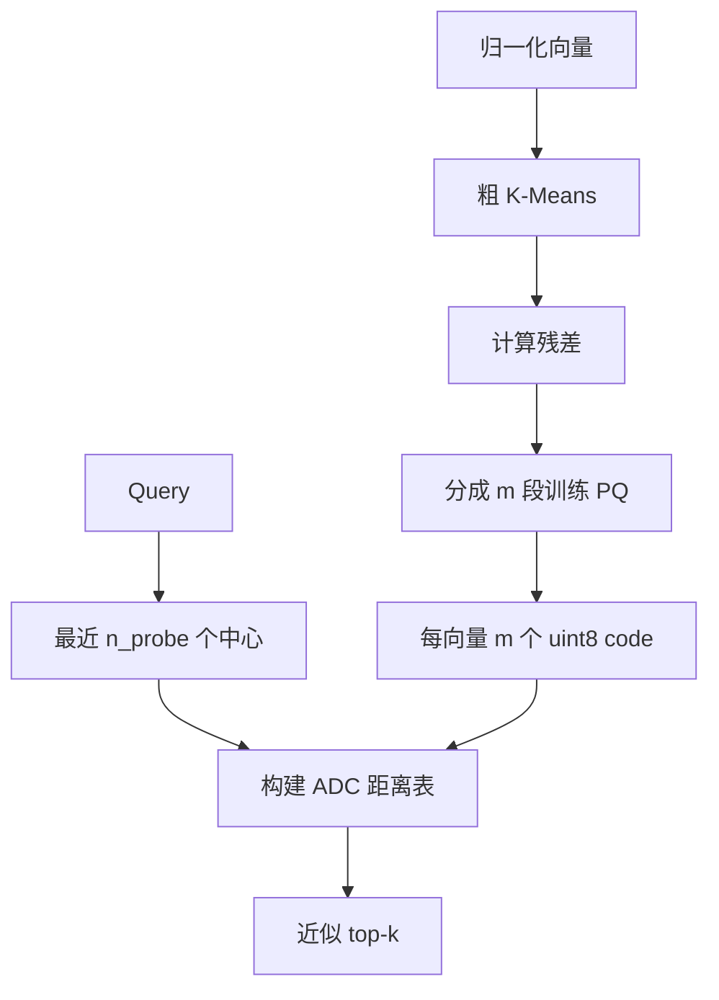

# 06｜残差 IVF-PQ

> 状态：**已实现** ｜ 路径：需要 `agentrag_core`

## 学习目标与先修知识

- 从精确搜索推导为什么需要粗量化和向量压缩。
- 理解 IVF、残差 PQ 和 ADC 的数据流。
- 用 Recall@k、构建时间、查询时间和内存共同评价近似索引。

## 当前实现边界

项目已经实现真正组合的残差 IVF-PQ、二进制持久化和 Python `IVFPQVectorStore`。索引是一次性静态构建，不支持增量添加。P1 合成基准的 `Recall@10=0.23` 是明确反例，因此默认后端仍是 NumPy。

## 概念直觉与核心公式

粗中心为 `c(x)`，残差为：

```text
r(x) = x - c(x)
```

把 d 维残差切成 m 个子向量，每段选择最近码字：

```text
code_j(x) = argmin_t ||r_j(x) - q_{j,t}||²
```

查询时只探测最近的 `n_probe` 个粗簇，并用 ADC 查表近似：

```text
d(q,x) ≈ Σ_j ||(q-c(x))_j - q_{j,code_j(x)}||²
```



当前实现每个子向量 code 使用一个 `uint8`，即使 `n_bits=4` 也没有位打包，所以编码载荷是 `N×m` 字节，而不是理论上的 `N×m×n_bits/8`。

## 项目调用链

- C++：`ivf_pq_index.cpp` 负责 build/search/save/load。
- PQ：`product_quantizer.cpp` 训练码本、编码和计算平坦 ADC。
- Python：`IVFPQVectorStore` 负责归一化、Chunk 映射和 metadata 文件。
- 基准：`scripts/benchmark_retrieval.py` 以 NumPy 精确结果为参考集合。

## 最小实验

```powershell
python examples/learning/run_lab.py --lab 06
python scripts/benchmark_retrieval.py --n-vectors 5000 --dim 64 --n-queries 100 --top-k 10 --n-clusters 64 --n-probe 8 --n-subvectors 8 --n-bits 4 --n-iters 8 --seed 42
```

课程实验比较较小与较大的 `n_probe`。通常探测更多簇不会降低候选覆盖，但会增加计算；具体 Recall 仍受数据、PQ 误差和随机初始化影响。

P1 原始快照：NumPy Recall@10=1.0、1,280,000 bytes；IVF-PQ Recall@10=0.23、80,480 bytes。它只说明该合成配置，不代表真实 RAG 质量。

## 常见错误、边界与反例

- 只报告压缩率，不报告召回，会掩盖不可用索引。
- `dim` 必须能被 `n_subvectors` 整除。
- `n_bits>8` 与 uint8 code 不兼容，当前实现明确拒绝。
- 载入索引时 C++ 文件与 `.meta.npz` 必须配套。
- 增大所有参数不是公平实验；应固定数据和预算，一次只改一个变量。

## 练习

1. `n_probe` 从 1 增到全部簇时，IVF 的候选遗漏如何变化？
2. 为什么仍可能无法达到精确 Recall=1？

<details><summary>参考答案</summary>

1. 粗簇造成的候选遗漏会减少，全部探测时不再因 IVF 丢候选。2. PQ 仍用量化码字近似残差距离，排序可能被量化误差改变；此外实现和 tie-breaking 也可能影响 top-k。

</details>

## 完成检查

- [ ] 能画出 build 和 search 两条数据流。
- [ ] 能解释 `n_probe/n_bits/m` 的不同作用。
- [ ] 会同时报告 Recall、延迟、构建和内存。

## 原始资料

- Jégou et al., [Product Quantization for Nearest Neighbor Search](https://doi.org/10.1109/TPAMI.2010.57).
- [P1 原始 CSV](../benchmarks/retrieval_p1.csv).

上一章：[05｜C++ 与 pybind11](05_cpp_pybind_kmeans.md) ｜ 下一章：[07｜BM25](07_bm25.md)
