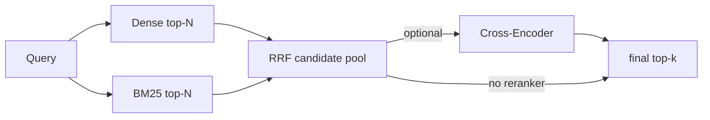

# 08｜混合检索与重排

> 状态：**部分实现** ｜ 主链路已实现；真实 Cross-Encoder 尚未运行验证

## 学习目标与先修知识

- 理解稠密召回、稀疏召回和重排解决的是不同问题。
- 掌握 RRF 为什么用排名而不是直接混合原始分数。
- 看懂候选池大小与最终 top-k 的关系。

## 当前实现边界

`RetrievalPipeline` 已能组合 NumPy/IVF-PQ、BM25/RRF 和可选 `CrossEncoderReranker`。默认仍是 `numpy + dense-only`；hybrid、IVF-PQ、reranker 都需显式启用。真实 reranker 模型尚未下载运行，因此只确认了接口和测试替身链路。

## 概念直觉与核心公式

RRF 对每个文档累加不同结果列表中的排名倒数：

```text
RRF(d) = Σ_i 1 / (K + rank_i(d))
```

项目使用 `K=60`。它不要求余弦分数和 BM25 分数同量纲，只关心排名。重排阶段再对少量 `(query, chunk)` 共同编码，换取更充分的 token 交互。



## 项目调用链

- `HybridRetriever.search()` 将两路候选扩到 `max(3k,30)` 后融合。
- `RetrievalPipeline` 统一 dense、hybrid、reranker 三种模式。
- 有 reranker 时，候选数至少为 `rerank_top_n`，最后再裁剪到 top-k。
- CLI 用 `--hybrid` 和 `--reranker-model` 显式开启。

## 最小实验

```powershell
python examples/learning/run_lab.py --lab 08
```

实验用 ToyEmbedding 制造“语义分数无法识别 X100”的反例，再观察 BM25/RRF 把精确型号文档提升。实验中的关键词重排器是测试替身，不是 Cross-Encoder。

真实模型路径会下载模型，需显式运行：

```powershell
agentrag ask "你的问题" --hybrid --reranker-model BAAI/bge-reranker-base
```

## 常见错误、边界与反例

- RRF 不保证总是优于单路检索，必须在 qrels 上验证。
- 候选池没有召回相关文档时，重排器无法凭空找回。
- 增加 reranker 会增加模型下载、内存和每个 query 的延迟。
- 用测试替身改变顺序，只能证明调用发生，不能证明真实质量提升。

## 练习

1. 为什么候选池通常大于最终 top-k？
2. 若 hybrid 的 Recall 提升但延迟翻倍，应该如何决策？

<details><summary>参考答案</summary>

1. 给融合和重排保留纠错空间；若一开始只取 k 个，相关项可能过早被裁掉。2. 固定真实查询集和延迟预算，报告质量绝对变化与资源代价；若收益不满足门槛，保持 dense 默认或只在特定查询启用。

</details>

## 完成检查

- [ ] 能解释 RRF 对量纲不敏感的原因。
- [ ] 能区分召回阶段和精排阶段。
- [ ] 不把测试替身结果写成真实模型提升。

## 原始资料

- Cormack et al., [Reciprocal Rank Fusion](https://doi.org/10.1145/1571941.1572114).
- Sentence Transformers, [Retrieve & Re-Rank](https://www.sbert.net/examples/sentence_transformer/applications/retrieve_rerank/README.html).

上一章：[07｜BM25](07_bm25.md) ｜ 下一章：[09｜提示、生成与 KV](09_prompt_generation_kv.md)
