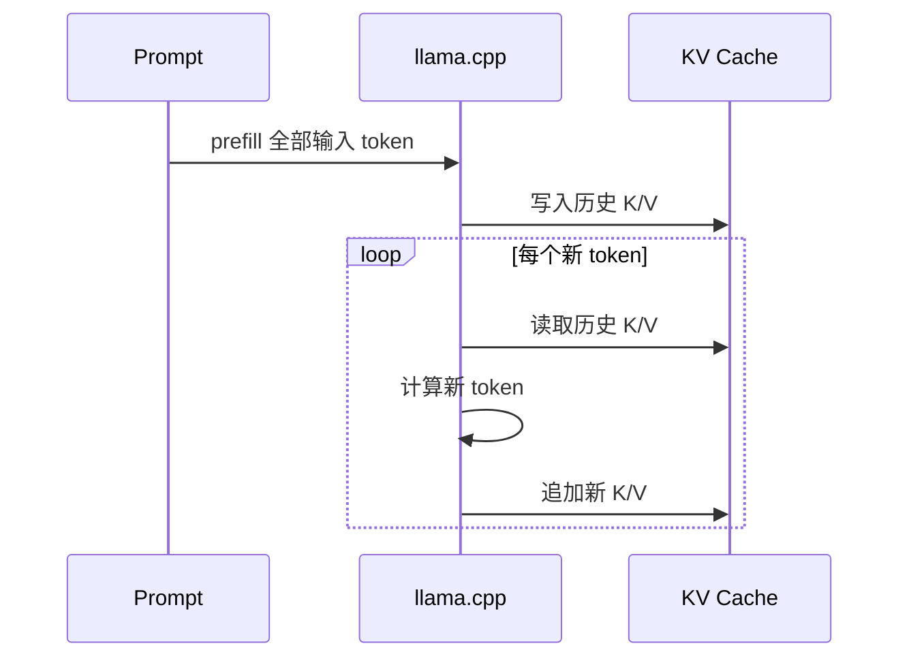

# 09｜提示、生成与 KV 监控

> 状态：**部分实现** ｜ Mock/接口已验证；真实 GGUF 最小验证待完成

## 学习目标与先修知识

- 理解 Prompt 如何把系统规则、参考文档、历史和问题分区。
- 区分 prefill 与 decode，并解释 KV Cache 的必要性。
- 看懂 `BaseLLM`、同步生成、流式生成和当前 KV 监控边界。

## 当前实现边界

`RAGPromptBuilder`、`MockLLM`、`LlamaCppEngine` 和 `KVCacheMonitor` 已实现。当前监控器依据上下文槽位做估算，`memory_bytes` 固定返回 0；它没有读取 llama.cpp 的真实 KV 内存。真实 Qwen GGUF 尚未完成最小对话验收。

## 概念直觉与核心公式

注意力的核心是：

```text
Attention(Q,K,V) = softmax(QKᵀ / √d_k)V
```

自回归生成第 t 个 token 时，过去 token 的 K/V 不会改变。缓存它们后，只需计算新 token 的 Q/K/V 并与历史交互。prefill 并行处理输入 Prompt；decode 逐 token 生成。



理想化 KV 载荷可估算为：

```text
bytes ≈ 2(K,V) × layers × kv_heads × seq_len × head_dim × bytes_per_value
```

实际布局、GQA、量化和运行时缓冲会改变结果，必须以底层实现测量为准。

## 项目调用链

- `RAGPromptBuilder.build()` 组装四类输入，`format_chunks_for_prompt()` 去掉检索分数。
- `GenerationConfig` 保存 sampling、上下文和线程参数。
- `LlamaCppEngine` 直接调用 llama-cpp-python completion 接口；当前没有显式套用模型 chat template。
- `MockLLM` 用固定回答验证控制流，不验证语言质量。
- `KVCacheMonitor` 只追踪 `used_slots` 和阈值建议。

## 最小实验

```powershell
python examples/learning/run_lab.py --lab 09
python examples/learning/real_model_lab.py --component generation --model-path models/qwen2.5-3b-instruct-q4_k_m.gguf
```

离线实验预期看到 Prompt 分区、Mock 流式输出与上下文使用率。真实模型缺失时第二条命令输出 `SKIPPED`；存在时才打印 `REAL generation`。

## 常见错误、边界与反例

- 字符数不等于 token 数，不能用字符串长度精确推断 `n_ctx`。
- `temperature=0` 提高确定性，但不能保证事实正确。
- 模型要求 chat template 时，裸 completion Prompt 可能降低指令遵循。
- `KVCacheMonitor.memory_bytes==0` 表示未知，不表示没有占用内存。
- 流式输出改善感知延迟，不一定降低总生成时间。

## 练习

1. 为什么增加检索 Chunk 会同时影响答案证据和 KV 内存？
2. Mock 流式测试能证明什么，不能证明什么？

<details><summary>参考答案</summary>

1. 更多 Chunk 可能提高召回，但也增加 Prompt token、prefill 时间和 KV 长度，并可能引入噪声。2. 能证明迭代器和 CLI 输出链路正确；不能证明真实 tokenizer、首 token 延迟、生成速度和回答质量。

</details>

## 完成检查

- [ ] 能区分 prefill、decode 和流式展示。
- [ ] 能解释当前 KV 监控为什么只是估算。
- [ ] 真实模型未运行时会明确写“未执行”。

## 原始资料

- Vaswani et al., [Attention Is All You Need](https://papers.nips.cc/paper/7181-attention-is-all-you-need).
- [llama.cpp 官方仓库](https://github.com/ggml-org/llama.cpp).

上一章：[08｜混合检索与重排](08_hybrid_rerank.md) ｜ 下一章：[10｜Agent](10_agent.md)
