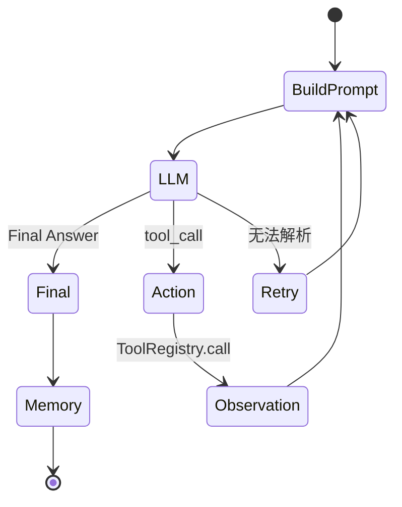

# 10｜Agent

> 状态：**部分实现** ｜ Mock ReAct 已验证；真实模型工具遵循和 KV 复用未验证

## 学习目标与先修知识

- 理解 Tool、Memory、Reasoning/Action/Observation 的职责边界。
- 能追踪一次工具调用如何回到下一轮 LLM Prompt。
- 区分查询改写、对话记忆和 Prefix Cache 三种不同机制。

## 当前实现边界

`ToolRegistry`、`ConversationMemory`、`WorkingMemory`、`QueryRewriter` 和 `ReActAgent` 已有 Mock 回归。Agent 每轮只调用一个工具，最多执行 `max_steps`。Prefix 模块只记录稳定前缀 hash、LRU 和 hit/miss，命中后仍把完整 Prompt 送给 LLM。

## 概念直觉与核心流程



ReAct 的价值不是“让模型自动正确”，而是把外部动作和中间观察显式加入循环，使行为可检查。工具输出仍是不可信输入，必须考虑错误、提示注入和参数校验。

## 项目调用链

- `ToolRegistry` 负责注册、Prompt 描述和异常转成错误字符串。
- `ConversationMemory` 保留 role/content；当前是内存列表，不持久化。
- `QueryRewriter` 有历史和 LLM 时补全指代；异常时返回原 query。
- `ReActAgent.run()` 在记录当前用户问题前先读取旧历史，避免问题重复。
- 稳定前缀由系统说明、工具描述和旧历史组成；当前轮 query/Observation 位于 suffix。

## 最小实验

```powershell
python examples/learning/run_lab.py --lab 10
```

实验使用顺序 Mock：第一次输出 tool_call，工具返回 Observation，第二次输出 Final Answer。预期 `cache_stats` 为一次 miss、一次 hit，且 mode 为 `logical`。

## 常见错误、边界与反例

- 工具不存在或执行异常时注册表返回错误文本，LLM 是否会修正仍取决于模型。
- 正则解析只支持当前 XML+JSON 约定，不是通用函数调用协议。
- 达到 `max_steps` 后会再请求一次强制最终回答；返回文本未必带 `Final Answer`。
- QueryRewriter 的失败回退保证可用性，但可能保留含糊指代。
- 逻辑 cache hit 不代表首 token 延迟下降。

## 练习

1. 为什么工具描述属于稳定前缀，而 Observation 属于变化后缀？
2. 如何验证 Agent 真的使用了工具结果，而不是猜出答案？

<details><summary>参考答案</summary>

1. 同一 Agent 会话内工具集合通常不变，而每步 Observation 都不同。2. 设计只有工具返回值中才存在的随机事实，记录 Prompt，断言第二轮包含该 Observation，并检查移除或篡改工具输出后答案是否变化。

</details>

## 完成检查

- [ ] 能画出 tool_call 到 Observation 的闭环。
- [ ] 能解释 memory、rewriter、prefix cache 的区别。
- [ ] 不用逻辑命中率声称真实加速。

## 原始资料

- Yao et al., [ReAct](https://arxiv.org/abs/2210.03629).

上一章：[09｜提示、生成与 KV](09_prompt_generation_kv.md) ｜ 下一章：[11｜CLI 集成](11_cli_integration.md)
