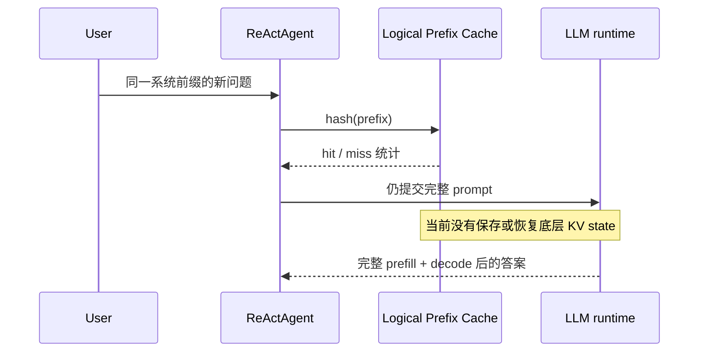

# 14｜真实 Prefix KV 预研

> 状态：**预研** ｜ 当前只有前缀哈希、LRU 与逻辑命中统计，没有真实 KV prefill 复用。

## 学习目标与先修知识

- 区分 prefill 与 decode 两个生成阶段；
- 用层数、KV heads、head dimension 和序列长度估算 KV 内存；
- 解释逻辑 Prefix Cache 与底层 KV state 复用的差异；
- 为未来实现定义可证伪的时延实验。

先修：[09｜提示、生成与 KV 监控](09_prompt_generation_kv.md) 和 Transformer Attention 基础。

## Prefill、Decode 与 KV

prefill 一次处理完整 prompt，为每层保存历史 token 的 Key 和 Value；decode 每次生成新 token，只需计算新 token 的 Q/K/V，并让 Query 与历史 Key 交互。KV Cache 避免了反复计算旧 token 的 K/V，但注意力读取的历史仍随上下文增长。

若每层使用 `H_kv` 个 KV heads，每个 head 维度为 `D`，序列长度为 `T`，每个元素 `B` bytes，则：

\[
KV\ bytes = 2 \times L \times H_{kv} \times T \times D \times B
\]

前面的 `2` 表示 Key 与 Value。以 Qwen2.5-3B 配置的 36 层、2 个 KV heads、head dimension 128、FP16、`T=4096` 为例，理论 KV payload 约为 `144 MiB`。实际占用还受 runtime 布局、对齐、batch 和量化方式影响。

## 当前实现边界



真实源码定位：

- `src/agent/prefix_cache.py`：保存 Python 层值、LRU 与 hit/miss；
- `src/agent/loop.py`：统计逻辑前缀命中；
- `src/generation/kv_cache.py`：槽位使用率监控，`memory_bytes` 当前返回 0；
- `src/generation/engine.py`：调用 `llama-cpp-python`，没有 KV state 导出/恢复接口接线。

因此命中率上升不等于 prefill 变快。当前实现可以回答“相同逻辑前缀出现过吗”，不能回答“底层计算节省了多少”。

## 真正复用需要什么

至少需要：

1. 明确 runtime 是否提供稳定的 state/KV 保存与恢复 API；
2. cache key 覆盖 tokenization、模型、adapter、位置与生成配置；
3. 验证恢复后的 token 序列与未缓存基线一致；
4. 定义容量、淘汰、并发隔离和模型切换失效策略；
5. 单独测量 prefill latency，不能只看总请求时间。

若底层 API 无法安全暴露，这条路线应停止或换成 runtime 原生的 prompt caching，而不是伪造 Python 层复用。

## 快速实验

理论内存估算：

```powershell
python examples/learning/run_lab.py --lab 14
```

逻辑命中实验：

```powershell
python examples/learning/run_lab.py --lab 10
```

预期现象：Lab 14 展示 KV payload 随序列长度线性增长；Lab 10 只输出逻辑 `hits/misses`。两者都不会声称执行了真实 KV 恢复。

## 未来可证伪实验

> 假设：对 token 完全相同的稳定前缀，恢复 runtime KV state 能使 prefill P50 延迟下降至少 50%，且固定种子的输出 token 与无缓存基线一致；速度或一致性任一失败即停止接入。

实验需分别记录冷启动、首次 miss、后续 hit、不同前缀长度、KV 内存和淘汰行为。

## 常见错误与反例

- 把字符串哈希命中当成 KV state 已恢复；
- 忽略 tokenizer 或位置变化导致的 cache key 失效；
- 只比较总延迟，让 decode 波动掩盖 prefill 收益；
- 用错误的 query head 数替代 KV head 数估算 GQA 模型内存；
- 将理论 payload 当成 runtime 实测显存。

## 练习题

1. 为什么 GQA 中必须使用 `n_kv_heads` 而不是 `n_attention_heads`？
2. 上下文从 4096 增至 8192 时，理论 KV payload 如何变化？
3. 逻辑 cache hit 能证明什么，不能证明什么？

<details><summary>参考答案</summary>

1. 多个 Query heads 可以共享同一组 Key/Value heads，KV 存储数量由 `n_kv_heads` 决定。
2. 其他参数不变时线性翻倍。
3. 它只证明相同 key 被访问过；不能证明 prefill 被跳过、延迟降低或底层状态正确复用。

</details>

## 完成检查表

- [ ] 我能写出 KV payload 公式并说明每一项。
- [ ] 我能区分逻辑命中统计与真实 prefill 复用。
- [ ] 我知道 `memory_bytes=0` 表示当前无法精确报告，而不是零占用。
- [ ] 我能为未来实现设置输出一致性和延迟两类门槛。

## 原始资料

- [Qwen2.5-3B 官方配置](https://huggingface.co/Qwen/Qwen2.5-3B/blob/main/config.json)
- [llama.cpp 官方仓库](https://github.com/ggml-org/llama.cpp)
- [Attention Is All You Need](https://papers.nips.cc/paper/7181-attention-is-all-you-need)

上一章：[13｜量化预研](13_quantization_preresearch.md) ｜ 下一章：[15｜生产化预研](15_production_preresearch.md)
