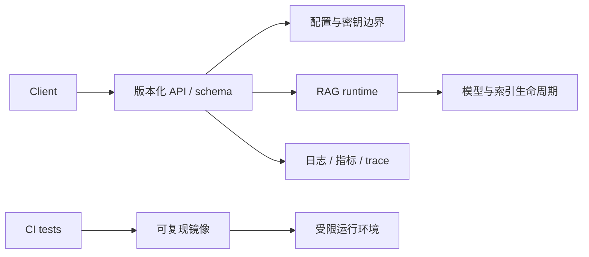

# 15｜生产化预研

> 状态：**预研** ｜ FastAPI 服务、统一配置加载、Docker 与 CI 尚未实现；`serve` 只是开发占位命令。

## 学习目标与先修知识

- 把“能在本机运行”拆成接口、配置、可观测性、交付和安全问题；
- 为 Phase 5 设计验收边界，而不是提前宣称已经生产化；
- 识别 RAG 服务特有的输入、模型和索引风险；
- 设计故障场景与回退策略。

先修：完成 [11｜CLI 集成与调试](11_cli_integration.md)。

## 从脚本到服务还差什么



当前仓库已经有 CLI 和模块边界，但没有 HTTP API schema、请求隔离、健康检查、镜像或 CI 工作流。`agentrag serve` 输出占位信息，不应作为服务已实现的证据。

## 五个建设面

### 1. 配置

明确默认值、配置文件、环境变量和 CLI 参数的优先级；敏感凭据只从安全渠道注入，不写入日志、镜像或仓库。配置加载失败必须显式报错。

### 2. API

定义请求/响应 schema、版本、超时、取消、流式中断和错误码。索引构建与在线查询最好有清晰的资源边界，避免一个超大文件阻塞所有请求。

### 3. 可观测性

记录结构化事件：request id、各阶段延迟、候选数量、模型/索引版本和错误类型。默认避免记录完整用户文本、检索片段和密钥。

### 4. 容器与依赖

固定 Python/C++/模型 runtime 版本，构建阶段验证扩展可导入。模型文件与索引通常作为外部挂载或受控制品，不直接提交到 Git。

### 5. CI 与安全

CI 至少覆盖格式/编译、单元测试、学习实验 smoke test 和文档链接。服务侧还要限制上传大小、路径、并发、生成 token 与工具权限，防范路径穿越、资源耗尽和 prompt injection 扩权。

## 快速实验：现状清单

```powershell
python examples/learning/run_lab.py --lab 15
```

实验只检查代表性生产化文件是否存在。当前预期 `src/api/server.py`、`Dockerfile` 与 `.github/workflows/ci.yml` 均为 `False`。这是一份边界证据，不是失败伪装。

## Phase 5 的建议验收条件

- API schema 有测试，超时、取消和错误返回可复现；
- 配置优先级和缺失模型/索引的错误路径有测试；
- 日志不泄漏 prompt、文档原文和凭据；
- 镜像能从空环境构建，健康检查能区分“进程存活”与“模型可用”；
- CI 运行完整快速测试，不依赖网络下载真实模型；
- 真实模型的慢速验证独立标记，缺失时明确 `SKIPPED`；
- 有并发、内存上限、故障注入和回滚演练记录。

## 故障场景练习

至少考虑：索引版本与模型维度不匹配、磁盘满、模型加载失败、客户端中途断开、工具超时、恶意超长输入、文档内 prompt injection、并发请求耗尽 KV 内存。

## 常见错误与反例

- 有 `serve` 命令就宣称已有 API 服务；
- Dockerfile 能 build 就宣称可生产部署；
- 把模型下载放进每次 CI，导致测试依赖网络且不可控；
- 为调试记录完整 prompt 与检索文档；
- 让 Agent 工具继承服务进程的全部文件和网络权限。

## 练习题

1. liveness 与 readiness 为什么要分开？
2. 哪些学习实验适合进入快速 CI，哪些不适合？
3. prompt injection 为什么不能只靠系统提示解决？

<details><summary>参考答案</summary>

1. 进程存活不代表模型、索引和依赖已经可用；分开后编排器不会过早导流，也能正确重启死进程。
2. Mock、小数据和离线实验适合；GGUF、Cross-Encoder 下载和大型性能基准应放在显式慢速任务中。
3. 不可信文档仍能诱导模型调用高权限工具；需要输入信任边界、最小工具权限、参数校验和人工确认等纵深防御。

</details>

## 完成检查表

- [ ] 我能列出当前仓库尚未实现的生产化组件。
- [ ] 我不会把 CLI 占位命令写成 HTTP 服务。
- [ ] 我能为配置、API、日志、容器和 CI 各写一个验收点。
- [ ] 我能描述至少三个 RAG 服务故障场景和回退方式。

## 原始资料

- [Docker 官方文档](https://docs.docker.com/)
- [GitHub Actions 官方文档](https://docs.github.com/actions)
- [OWASP Top 10 for LLM Applications](https://genai.owasp.org/llm-top-10/)

上一章：[14｜真实 Prefix KV 预研](14_prefix_kv_preresearch.md) ｜ 返回：[课程目录](README.md)
